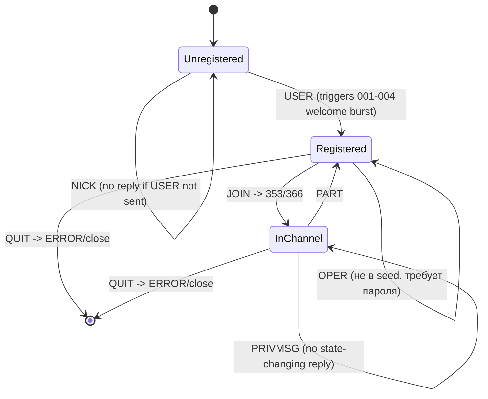

# Эталонная диаграмма состояний IRC (по RFC 2812) для сравнения с AFLNet ipsm.dot

Построена вручную по спецификации, т.к. научных работ по фаззингу IRC не найдено.

## Реально найденный автомат AFLNet (ipsm.dot) — подробный разбор

См. docs/experiment.md, раздел 12 — там построчная расшифровка
каждого узла графа (числовые коды RFC 2812 + наш djb2-хеш команды
ERROR=5599) и вывод о насыщении пространства состояний по трём
независимым прогонам. Картинки графов — docs/screenshots/ipsm_*.png.

Итог сопоставления: happy-path AFLNet (0->1->2->3->4->5->251->254->
255->265->266->250->422) точно соответствует ожидаемому по
диаграмме выше пути Unregistered->Registered->InChannel. Ветки
MODE/OPER, отмеченные на диаграмме как не покрытые, действительно
не нашлись фаззером (согласуется с LCOV: irc-mode.c/irc-oper.c = 0%).
